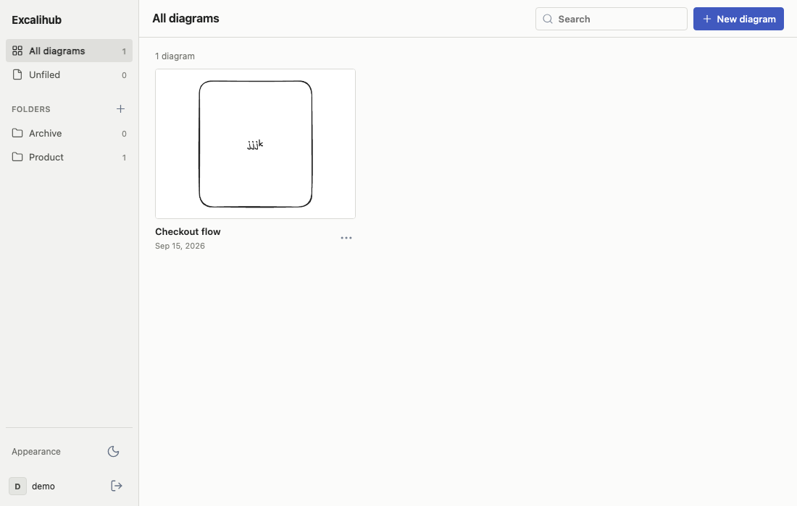
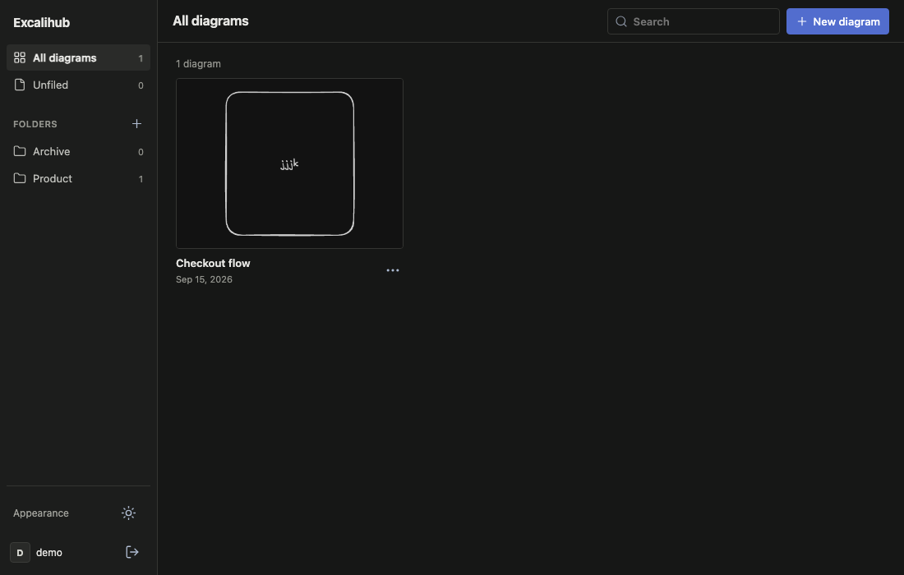

# Excalihub

A self-hosted SvelteKit app using Excalidraw, with username/password login and a private diagram library for every user. There is no registration endpoint or default account.

## Run locally

Requires Node.js 24+ and npm.

```sh
npm ci
npm run user:create -- alice
npm run dev
```

The account command prompts for a password (at least 8 characters). Open http://127.0.0.1:5173 and sign in. Create more accounts with the same command. SQLite storage is initialized automatically at `data/excalihub.sqlite`.

## Features

- The full Excalidraw drawing engine, with locally served fonts.
- Create, browse, search, open, rename, and delete diagrams.
- Organize diagrams in private folders using the sidebar and card menus. Deleting a folder moves its diagrams to Unfiled.
- Dark theme by default, with a persistent light/dark switch shared by the library and editor.
- Automatic saves after editing pauses, a manual Save button, and Cmd/Ctrl+S.
- Theme-aware diagram thumbnails and `.excalidraw` downloads. Excalidraw's menu supports importing drawings and image exports.
- Saved scenes include embedded images and canvas settings.
- Private per-user libraries with server-side authorization.
- Version checks prevent silently overwriting changes made in another tab. On a conflict, download the current drawing, then reload to see the saved version.

Multiuser means separate accounts and private libraries. Live collaborative editing and shared diagrams are not included.

## Screenshots

### Light theme



### Dark theme



## Manage accounts

```sh
npm run user:create -- bob
npm run user:list
npm run user:password -- alice
```

Changing a password revokes that user's existing sessions. For automation, account commands accept `--password-stdin`; pass the password through stdin rather than a command-line argument. There is no public account creation or password reset flow.

## Production with Docker

The published image supports `linux/amd64` and `linux/arm64`:

```text
ghcr.io/mishankov/excalihub:latest
```

### Docker

Create a persistent volume and start the application:

```sh
docker volume create excalihub-data
docker run -d \
  --name excalihub \
  --restart unless-stopped \
  -p 127.0.0.1:3000:3000 \
  -e APP_ORIGIN=http://localhost:3000 \
  -e COOKIE_SECURE=false \
  -v excalihub-data:/app/data \
  ghcr.io/mishankov/excalihub:latest
```

Create the first account after the container starts:

```sh
docker exec -it excalihub node scripts/users.mjs create alice
```

### Docker Compose

Save the following as `compose.yaml`:

```yaml
services:
  excalihub:
    image: ghcr.io/mishankov/excalihub:latest
    ports:
      - '127.0.0.1:3000:3000'
    environment:
      APP_ORIGIN: http://localhost:3000
      COOKIE_SECURE: 'false'
      DATABASE_PATH: /app/data/excalihub.sqlite
    volumes:
      - diagrams:/app/data
    restart: unless-stopped

volumes:
  diagrams:
```

Start the application and create the first account:

```sh
docker compose up -d
docker compose exec excalihub node scripts/users.mjs create alice
```

Visit http://localhost:3000. The named volume keeps accounts and drawings across container restarts. Docker binds to the loopback interface by default.

For network access, put an HTTPS reverse proxy in front and set `APP_ORIGIN=https://your-domain.example` and `COOKIE_SECURE=true`. `APP_ORIGIN` must exactly match the browser origin, including its port when one is present, with no trailing slash. The proxy must preserve the Cookie and Origin headers.

### Build from source

The Compose file included in this repository builds the image locally:

```sh
docker compose up -d --build
docker compose exec excalihub node scripts/users.mjs create alice
```

To run directly without a container:

```sh
npm ci
npm run build
APP_ORIGIN=http://localhost:3000 npm start
```

Use `.env` (see `.env.example`) or environment variables to configure `DATABASE_PATH`, `APP_ORIGIN`, and `COOKIE_SECURE`. Start the server and run account commands with the same database path. The production app is a single Node process using SQLite; use a local persistent disk, not a network-mounted SQLite file.

## Storage and security

Passwords use scrypt with individual random salts. Sessions use random tokens stored as hashes in the database, expire after seven days, and use HttpOnly, SameSite cookies. State-changing endpoints check Origin. Login attempts are limited to five per username per 15 minutes; after the limit, wait for the window to expire. All diagram operations enforce ownership. Database requests use bound parameters.

Scenes are limited to 20 MB per save, including embedded images and the thumbnail. A failed save is shown in the editor; download a copy before leaving if it cannot be saved. The app warns before closing a tab with unsaved edits. This is not an offline editor.

Back up the database using SQLite's online backup command, or stop the app before copying the entire data directory (including WAL files). Restore with the app stopped. Keep the database outside the public directory and restrict filesystem access.

## Validation

```sh
npm test
npm run check
npm run build
```

Tests use isolated temporary databases to check authentication, session revocation, rate limiting, persistence, user isolation, and conflicting updates. For HTTP integration coverage against a built app:

```sh
npm run test:integration
```

## Architecture

Svelte 5 and SvelteKit handle pages, navigation, and API endpoints. The Node adapter produces the self-hosted server. React is used only in `src/lib/excalidraw.ts` to mount the Excalidraw component; the rest of the interface is Svelte. Persistence and account commands share `server/store.mjs`, which uses Node’s built-in SQLite and crypto modules.
